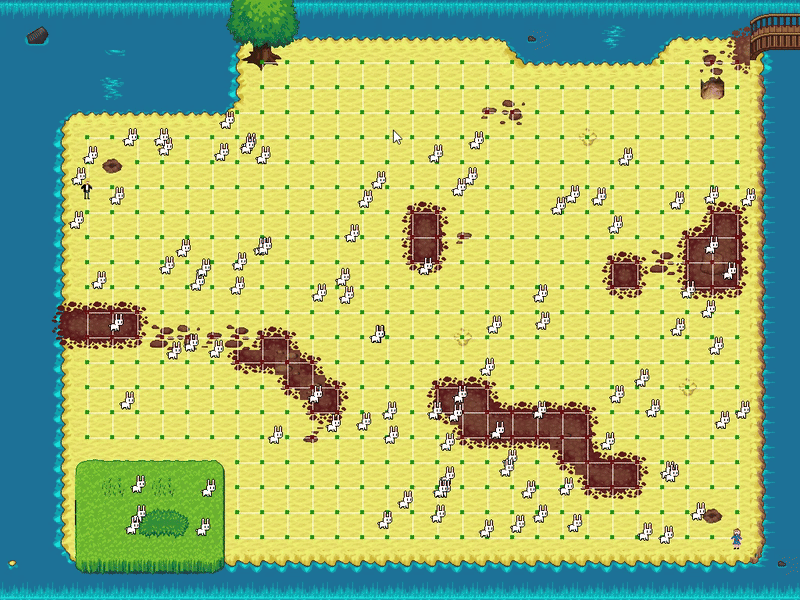
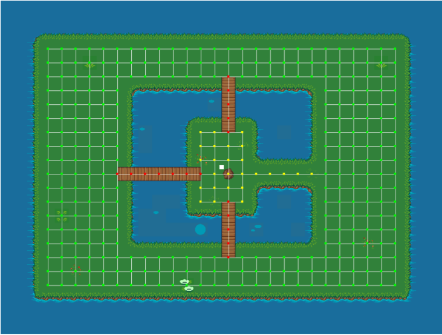

# kmintapp

`kmintapp` is a C++ application built on top of a reusable simulation framework (`libkmint`).  
It is an **agent-based 2D simulation**: autonomous entities move around a world, make decisions based on their environment, and interact according to simple rules. The project was built as an **educational / course assignment** and shows how to structure a non-trivial C++ codebase with a clear separation between framework code and your own simulation logic.

> This repository contains both the generic `libkmint` framework and a concrete simulation in `sim/`.

---

## 🖼 Screenshot

If you’re viewing this on GitHub you should see a preview of the running simulation:



---

## ✨ Features

- **Agent-based simulation**
  - Multiple entities (“agents”) moving in a 2D world.
  - Each agent has its own behaviour / update logic.
- **Time-step based world update**
  - Discrete simulation “ticks” to update positions and states.
  - Deterministic behaviour when using the same configuration.
- **Reusable simulation framework (`libkmint`)**
  - Core types for worlds, actors, timing and drawing.
  - Abstract base classes and utilities so you only implement your scenario logic.
- **Rendering & window management**
  - C++ rendering via a framework in `libkmint` and vendored dependencies (C / C++).
  - Separate application layer (`sim/`) that connects your simulation to the framework.
- **CMake-based build**
  - Cross-platform C++ build (Windows / Linux / macOS) using CMake.
  - Out-of-source build in `out/build/x64-Debug` (pre-generated in this repo).
- **Nix / direnv development environment (optional)**
  - `shell.nix` and `.envrc` for a reproducible dev environment when using Nix + direnv.

---

## 🗂 Project Structure

High-level layout of the repository:

```text
kmintapp/
├─ dependencies/        # Git submodules / external C & C++ libraries
├─ libkmint/            # Shared simulation framework (engine-style code)
├─ sim/                 # Your concrete simulation (domain-specific logic)
├─ out/
│  └─ build/
│      └─ x64-Debug/    # Example out-of-source build tree
├─ .envrc               # direnv hook for Nix shell (optional)
├─ .gitmodules          # Submodule definitions (for dependencies/libkmint)
├─ CMakeLists.txt       # Top-level CMake build configuration
├─ shell.nix            # Nix shell for development (optional)
├─ screenshot.png       # Screenshot of the running simulation
├─ tutorial.md          # Course / assignment tutorial (how to extend the sim)
└─ README.md            # This file
```

Conceptually:

**Framework (`libkmint/`)**
- Contains generic building blocks for creating simulations.
- Handles world, actors, timing, drawing, input, etc.

**Application / scenario (`sim/`)**
- Contains the concrete behaviour for this assignment.
- Uses framework abstractions to define:
  - World layout and initial state.
  - Agent types and their behaviour.
  - Any scenario-specific rules, scoring, or visualisation.

---

## 🧰 Tech Stack

- **Language**: Modern C++ (plus some C for low-level dependencies).
- **Build system**: CMake
- **Tooling / environment**:
  - Optional Nix development shell (`shell.nix`)
  - Optional direnv integration (`.envrc`)

> Exact library versions are managed via `dependencies/` and the `CMakeLists.txt` file.

---

## 🚀 Getting Started

### 1. Prerequisites

You’ll need:
- A C++ compiler (for example):
  - GCC or Clang on Linux / macOS
  - MSVC (Visual Studio) on Windows
- CMake (3.x+ recommended)
- (Optional) Nix and direnv if you want to use the provided development shell.

**Optional: Using Nix + direnv**

If you use Nix:
1. Install nix and direnv.
2. Allow direnv in the project folder:
   ```bash
   cd /path/to/kmintapp
   direnv allow
   ```
   This will automatically load the environment described in `shell.nix` whenever you enter the directory.

---

### 2. Clone the Repository

```bash
git clone --recurse-submodules https://github.com/ferrannl/kmintapp.git
cd kmintapp
```

> The `--recurse-submodules` flag is important so that `dependencies/` and `libkmint/` are checked out properly.  
> If you already cloned without it, run:
> ```bash
> git submodule update --init --recursive
> ```

---

### 3. Configure & Build (CMake)

A typical out-of-source build looks like this:

```bash
# From the repository root
mkdir -p out/build
cd out/build

# Configure the project
cmake ../..

# Build (Debug configuration by default)
cmake --build .
```

On Windows with Visual Studio installed, you can also open the generated solution from `out/build` and build from the IDE.

---

### 4. Running the Application

After a successful build, the compiled executable will be placed somewhere inside the `out/build` tree (for example in `out/build/x64-Debug/` depending on your platform and generator).

From the build directory:

```bash
cd out/build
# Example – adapt to your platform/executable name:
./kmintapp           # Linux / macOS
.\kmintapp.exe       # Windows
```

If your generator uses configuration subfolders (e.g. Visual Studio):

```bash
cd out/build/x64-Debug
./kmintapp           # or .\kmintapp.exe on Windows
```

> If the main executable ends up with a different name (e.g. `sim`), run that instead.

---

## 🧠 How Things Work (High-Level)

1. **Framework setup (`libkmint`)**
   - Defines a world that contains all active entities.
   - Provides a main game loop that:
     - Processes input / timing.
     - Updates all agents.
     - Draws the current state.

2. **Scenario definition (`sim/`)**
   - Defines which agents exist in the world.
   - Specifies how they move and react.
   - Controls how they are drawn on the screen.

3. **Main entry point**
   - The app creates the initial world / agents and then hands control over to the framework loop, which keeps running until the user closes the window or the simulation ends.

This separation makes it easy to:
- Reuse the same framework for different scenarios.
- Focus your changes in `sim/` when implementing new behaviour.

---

## 🧪 Testing

This repository does not ship with a separate, explicit test suite in a `tests/` folder, but the simulation itself is a good behavioural test:

- If it compiles and runs correctly,
- and the agents behave as expected in the visualisation,

then the assignment requirements are (usually) met.

If you’d like to extend the project for your own learning, a recommended structure is:

```text
kmintapp/
├─ tests/
│  ├─ CMakeLists.txt
│  └─ ...
└─ ...
```

And add CTest, GoogleTest or Catch2 to validate specific behaviours.

---

## 🔧 Development Notes

Some tips when working with this codebase:

- Keep framework code (`libkmint/`) and scenario code (`sim/`) separate.
- When adding new features:
  1. Add or adjust your agents / world setup in `sim/`.
  2. Only touch `libkmint/` if you need new generic engine features that could be reused.
- If you break something:
  - Always try a clean rebuild:
    ```bash
    rm -rf out/build
    mkdir -p out/build
    cd out/build
    cmake ../..
    cmake --build .
    ```

---

## 🤝 Contributing

This is primarily an educational / personal project, but you can still work with it in a standard GitHub way:

1. Fork the repository.
2. Create a feature branch:
   ```bash
   git checkout -b feature/my-experiment
   ```
3. Commit your changes:
   ```bash
   git commit -m "Describe what you changed"
   ```
4. Push the branch and open a Pull Request on GitHub.

---

## 📄 License

No explicit license is provided.  
Treat this as an internal / educational project – all rights reserved by the author unless stated otherwise.

If you plan to reuse parts of this repository in a public or commercial project, contact the author first.

---

## 👤 Author

Ferran – @ferrannl

If you have suggestions, run into build issues, or just want to show what you built on top of this, feel free to open an issue on the repository.
```

✅ Fixed:  
- Closed the `text` code block after the directory tree.  
- Converted conceptual explanations, tech
